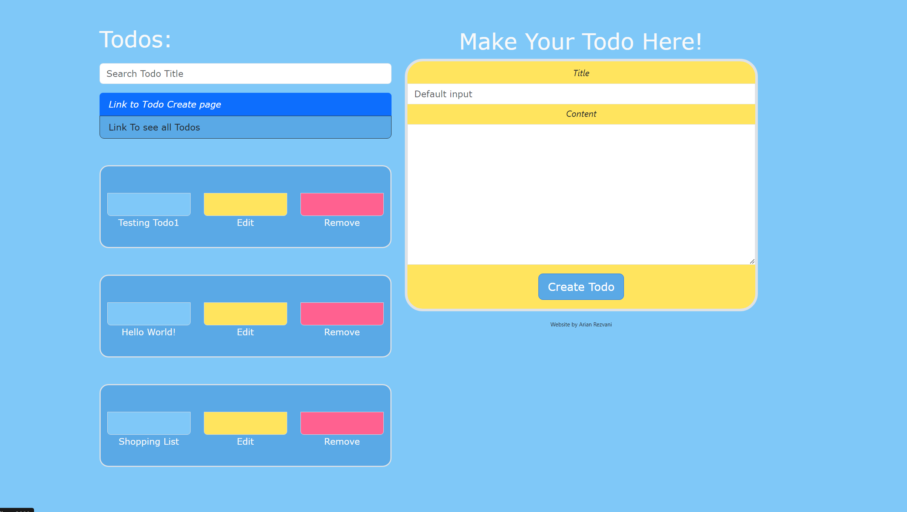
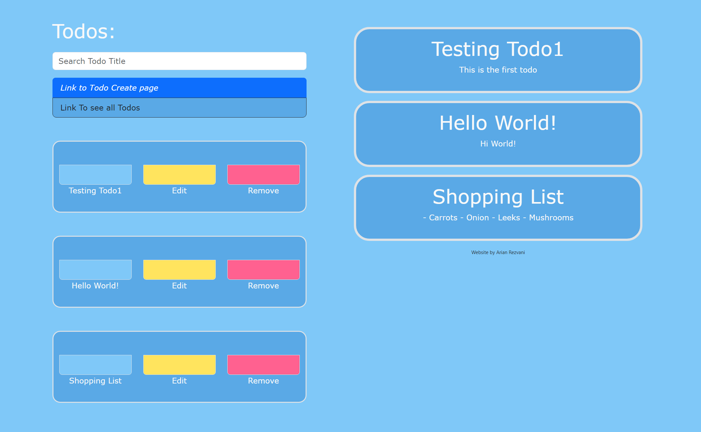
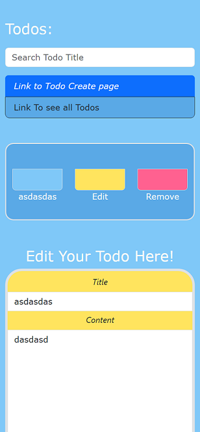

# Todo/Personalized Blog Posting

This is a simple website that allows anyone to make as many todos/blogs posts as they'd like!
 

| Tools Used  |
| ----------- |
| EJS |
| Express |
| Body-Parser |

## Goal

My goal for this project was to see if I could implement the use of express alongside EJS to handle 
CRUD requests from the client to server side and have them reflect back on the webpage. 
There are many things that I'd likely implement to either this/or future projects such as:

- A warning modal to prevent accidental user Deletion/Updating
- Todo/blog Categorizing for a more organized user experience
- Persistent Data functionality i.e. IndexDB or SQL/MongoDB

 

### Images

 

 

